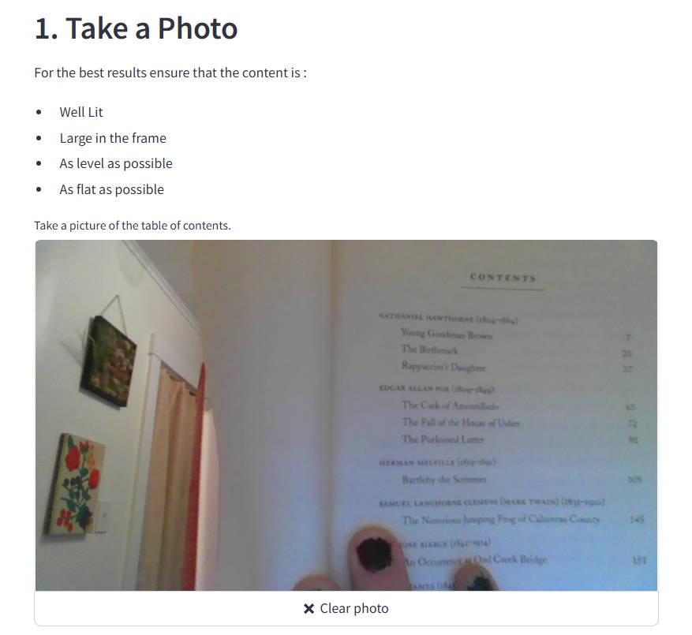
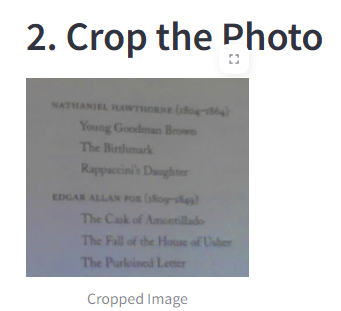
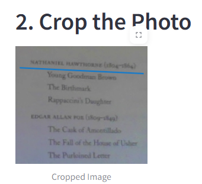
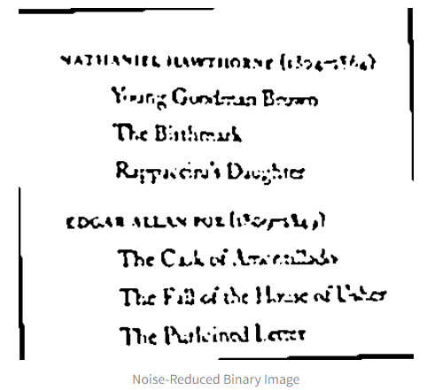
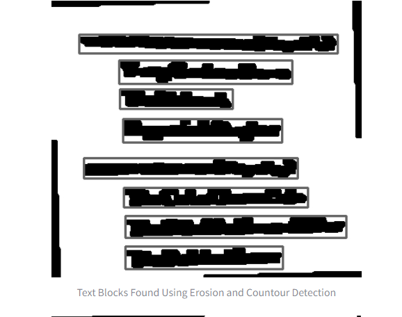
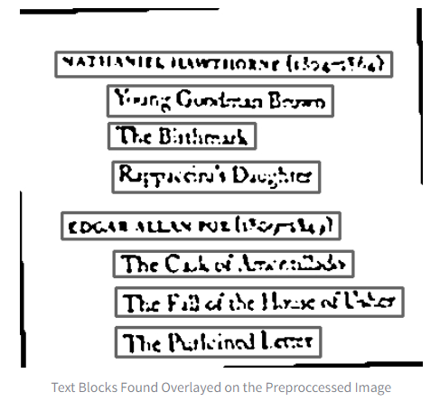
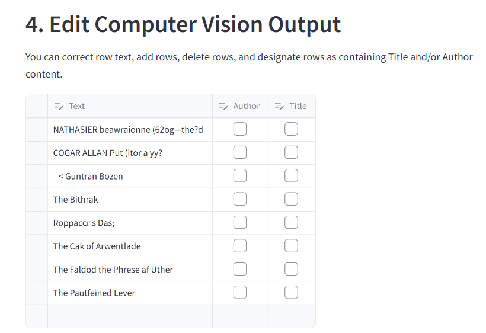
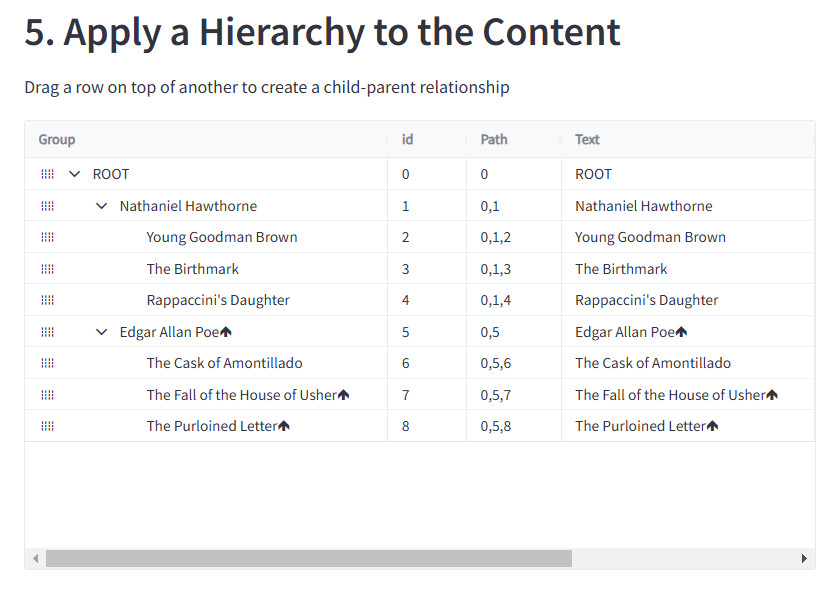

# TableOfContentsScanner

## Project Description

This prototype allows users to take a photograph of a table of contents, preprocess it, and extract relevant text as determined by the user. The idea was inspired by mobile deposit features common in banking apps. Using basic preprocessing principles and PyTesseract for OCR, this full-stack solution provides a strong starting point for further feature development and refinement.

---

## How it Works

1. **Take a well-lit photograph of the table of contents**  
   

2. **Crop the image, focusing on the relevant text (less is more here!)**  
   

3. **Draw a line to straighten the photograph**  
      

4. **Reduce noise for cleaner OCR results**  
   

5. **Identify text blocks using erosion and contouring**  
   

6. **Review discovered text blocks**  
   

7. **Edit the extracted information as needed**  
   

8. **Apply hierarchy to organize the returned author/title information**  
   

9. **Review the final structure**  
   

---

## Contact Us

- **Keegan Moseley** - [keegantm@comcast.net](mailto:keegantm@comcast.net)  
- **Ryan Moore** - [williamryanmoore@gmail.com](mailto:williamryanmoore@gmail.com)

---

## Setup Instructions

1. **Install Dependencies**  
   Install the conda environment using the `.yaml` file, or manually download the following packages:
   - `streamlit`
   - `cv2`
   - `numpy`
   - `PIL`
   - `streamlit_drawable_canvas`
   - `pandas`
   - `scipy`
   - `pytesseract` *(Note: You will likely have to use `pip install` for this)*
   - `st_aggrid`

2. **Run the Program**  
   Navigate to the `TableOfContentsScanner` directory and use the following command to start the program:  
   ```bash
   streamlit run main.py
